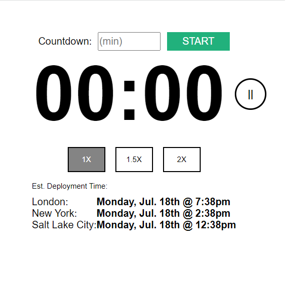
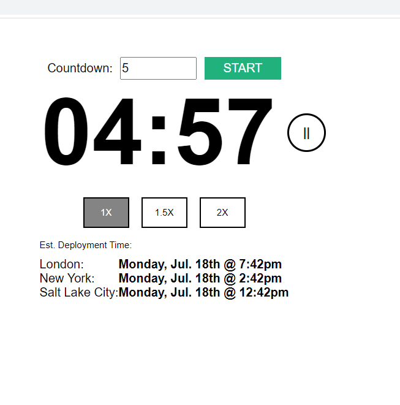
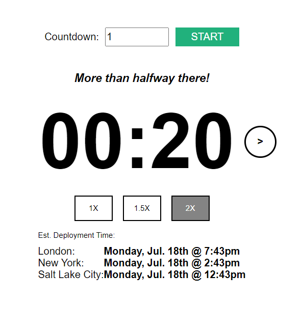
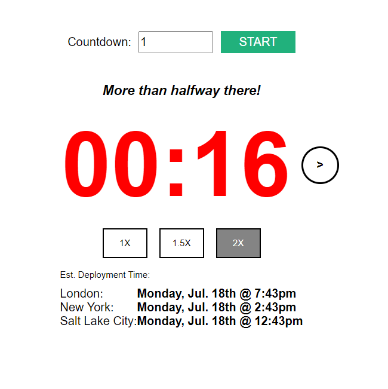
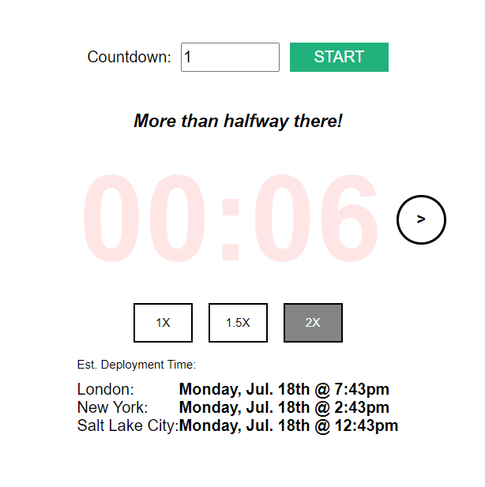
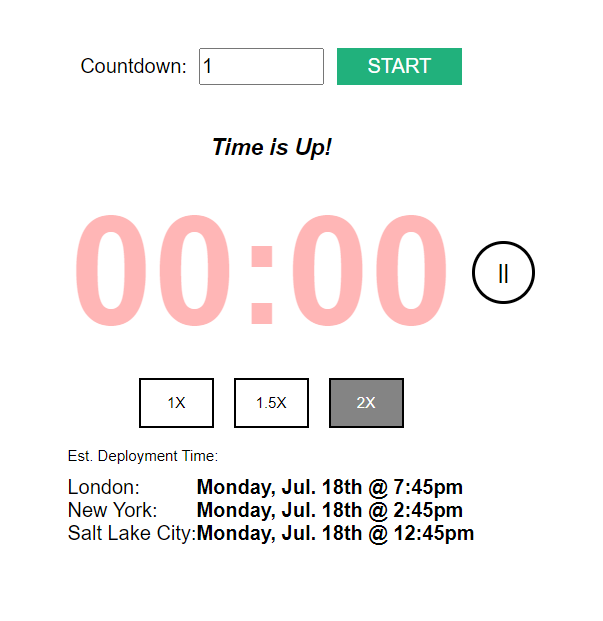

> # Countdown Timer

This application shows a Countdown Timer which starts running after the user set an amount of minutes into the form and
click on Start button.

When the timer starts, the final date is calculate for the cities at the bottom of the page.

<br>


> ## Install the dependencies and run the application

```bash
# Install
yarn install

# Run locally - Will be running at http://localhost:3000
yarn dev
```

<br>

> ## How to run the tests

```bash
yarn test
```

<br>

> ## Improvements

Due to the lake of time to implement everything I had in mind, I'll just explain what I would do before promoting this application to production:

- The code coverage should be analyzed to add tests to improve its percentage. A good practice is to keep the coverage up to 80%;

- I would create a file .env to configure all environment variables;

- The applications have some problems that need attention as the reset function to reset all the states after the clock is finished;

- Should be interesting, depending on new requirements to transform the Countdonw Timer into a hook to be more efficient and clear.

- Due to the lake of time, I used the library `moment-timezone` to calculate the new dates, because it is a well tested and easy to use library. As the requirements didn´t mentioned that third party librarys weren't forbidden, I thought this is wasn't an issue.

- The code need an improvement to configure media queries to make the layout responsive and to better fit big screens as flat TV's.

<br>

> ## Screenshots

- Home - before the clock starts:

<h1 align="center">
    
</h1>

- Home - after the clock starts:

<h1 align="center">
    
</h1>

- Home - when the clock is paused and running in 2x speed:

<h1 align="center">
    
</h1>

- Home - after text went red:

<h1 align="center">
    
</h1>

- Home - when timer starts blinking when at the final 10 seconds:

<h1 align="center">
    
</h1>

- Home - when time is up:

<h1 align="center">
    
</h1>
